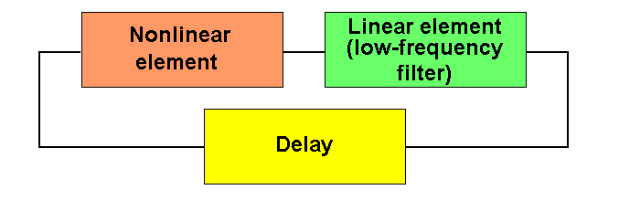
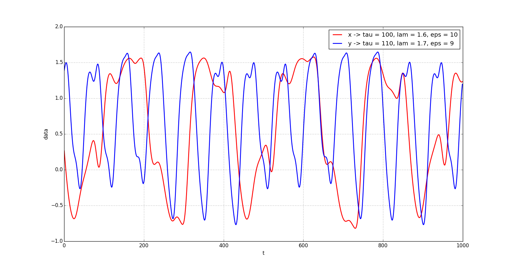
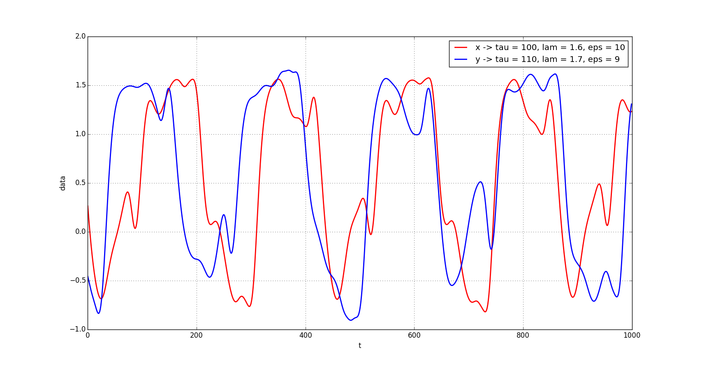
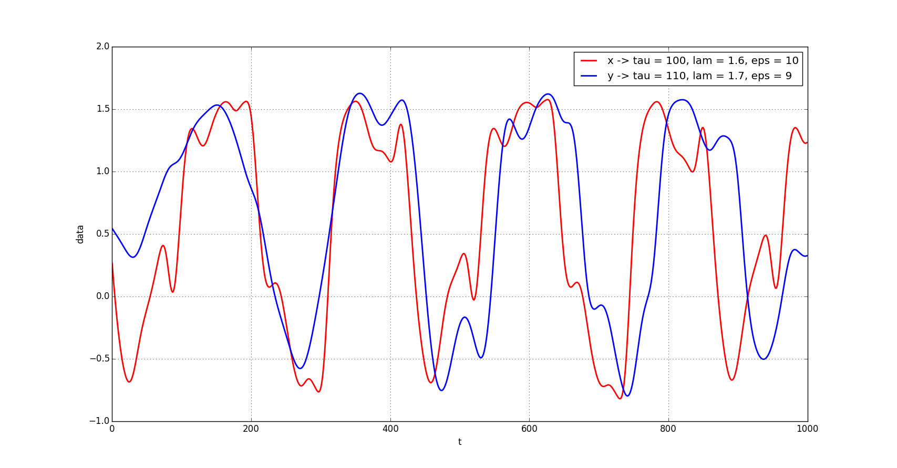

# Time Delay System

## Description

It's a block diagram of time delay system. 

## Motivation

Time-delays appear in many engineering systems - aircraft, chemical control
systems, in lasers models, in internet, biology, medicine ...
There can be transport, communication or measurement delay. It's important to analyze these systems. 

## Results

Here's transmitter - x(t) and receiver - y(t) with different coupling coefficient k. We can see chaotic synchronization.

k = 0

k = 0.1

k = 0.2

## Learn more

- [Useful articles](http://nonlinmod.sgu.ru/publications_en.htm)

## Installation

You can use [Python](https://www.python.org/) with data package: [Anaconda](https://www.anaconda.com/) or [Miniconda](https://conda.io/miniconda).
There's another way - use [Portable Python](http://portablepython.com/). Also you can use whatever IDE for Python.

## License

Free